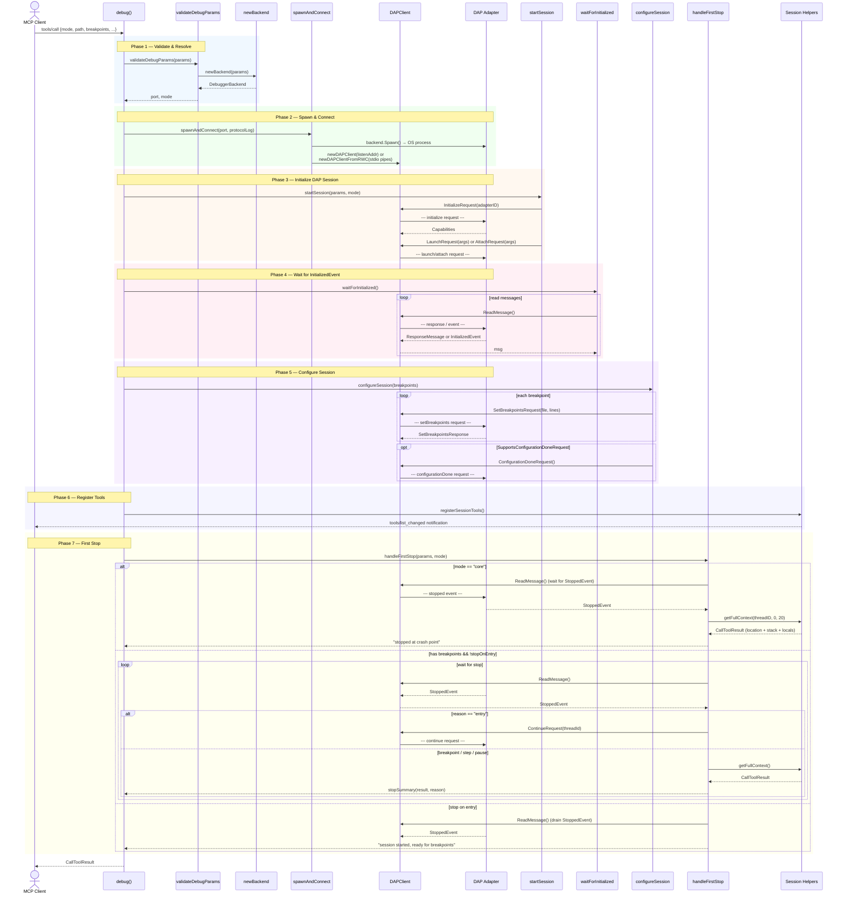
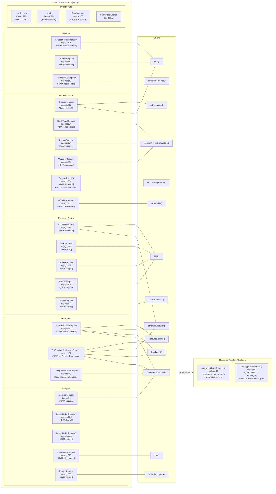
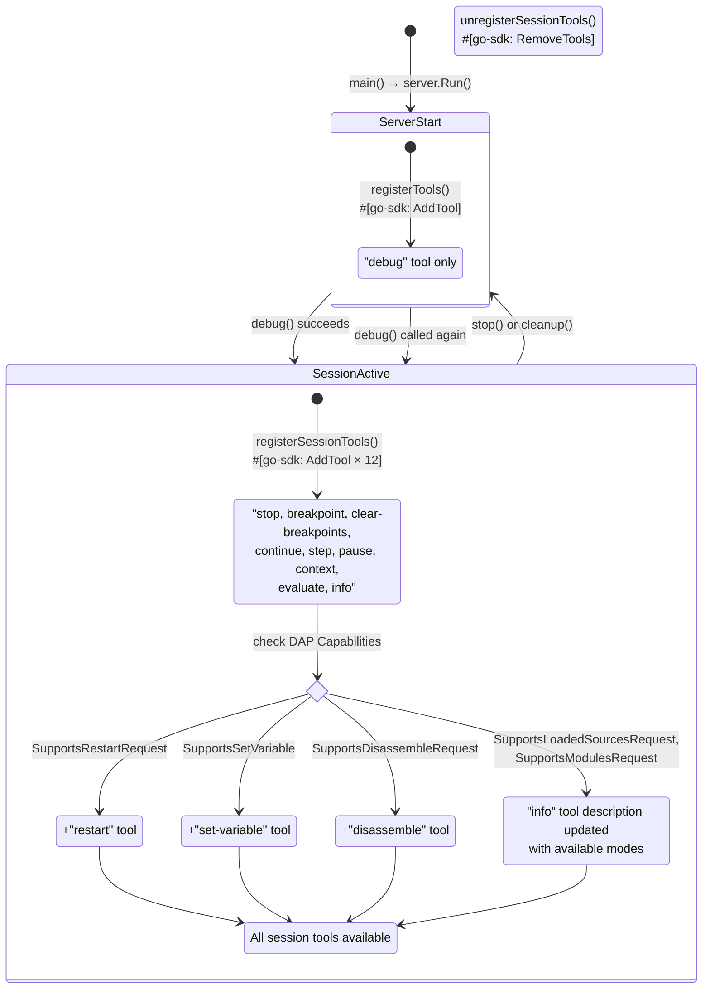
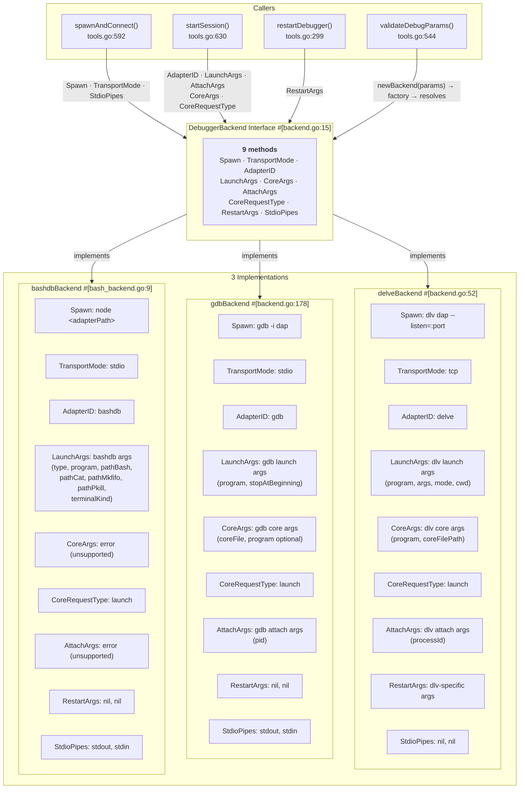

# Architecture Reference

## 1. Component Architecture

```mermaid
flowchart TB
    subgraph EXT["External"]
        mcp_client["MCP Client<br/>(AI assistant / IDE)"]
        adapter["DAP Adapter<br/>(dlv / gdb / bashdb)"]
    end

    subgraph APP["mcp-dap-server Process"]
        direction TB

        subgraph MCP["MCP Layer #[go-sdk]"]
            direction LR
            stdio["StdioTransport<br/>main.go:48"]
            mcp_srv["mcp.Server<br/>main.go:48"]

            subgraph MCP_Features["Server Features"]
                mcp_tools["13 Tools<br/>#[MCP: tools/*]"]
                mcp_prompts["4 Prompts<br/>#[MCP: prompts/*]"]
            end
        end

        subgraph TL["Tool Layer"]
            direction TB
            ds_struct["<b>debuggerSession</b><br/>session.go:16<br/>mutex, cmd, client,<br/>backend, capabilities,<br/>launchMode, stoppedThreadID"]

            subgraph TOOLS["Tool Handlers #[MCP: tools/call]"]
                direction LR
                T_debug("<b>debug</b><br/>tools.go:519")
                T_context("<b>context</b><br/>tools.go:816")
                T_continue("<b>continue</b><br/>tools.go:131")
                T_step("<b>step</b><br/>tools.go:842")
                T_breakpoint("<b>breakpoint</b><br/>tools.go:911")
                T_clear("<b>clearBreakpoints</b><br/>tools.go:92")
                T_evaluate("<b>evaluate</b><br/>tools.go:216")
                T_setvar("<b>setVariable</b><br/>tools.go:280<br/>#[GATED]")
                T_disasm("<b>disassemble</b><br/>tools.go:446<br/>#[GATED]")
                T_restart("<b>restart</b><br/>tools.go:299<br/>#[GATED]")
                T_pause("<b>pause</b><br/>tools.go:196")
                T_info("<b>info</b><br/>tools.go:323")
                T_stop("<b>stop</b><br/>tools.go:484")
            end

            subgraph DEBUG_SUB["debug() Sub-Phases #[tools.go:519]"]
                direction LR
                D1["validateDebugParams<br/>tools.go:544"]
                D2["spawnAndConnect<br/>tools.go:592"]
                D3["startSession<br/>tools.go:630"]
                D4["waitForInitialized<br/>tools.go:689"]
                D5["configureSession<br/>tools.go:706"]
                D6["handleFirstStop<br/>tools.go:739"]
                D1 -->|"port, mode"| D2
                D2 --> D3
                D3 --> D4
                D4 --> D5
                D5 --> D6
            end

            subgraph SESSION["Session Helpers #[session.go]"]
                direction LR
                S_ctx("getFullContext")
                S_thr("getThreadList")
                S_scp("writeScopesAndVariables")
                S_sum("stopSummary")
                S_reg("registerSessionTools<br/>#[go-sdk: AddTool]")
                S_unreg("unregisterSessionTools<br/>#[go-sdk: RemoveTools]")
                S_clean("cleanup")
            end
        end

        subgraph DAL["DAP Client Layer"]
            direction TB
            dap_client["<b>DAPClient</b><br/>dap.go:25<br/>rwc, seq, decoder, logWriter"]

            subgraph DAP_READ["Response Readers #[tools.go]"]
                read_val["readAndValidateResponse<br/>tools.go:18"]
                read_type["readTypedResponse[T]<br/>tools.go:51"]
            end

            subgraph DAP_SEND["Request Methods #[dap.go, go-dap wrappers]"]
                direction LR
                D_init["initialize"]
                D_launch["setBreakpoints<br/>setFunctionBreakpoints"]
                D_ctrl["continue, next, stepIn,<br/>stepOut, pause"]
                D_ins["threads, stackTrace,<br/>scopes, variables, evaluate"]
                D_cfg["configurationDone<br/>#[GATED]"]
                D_misc["disconnect, restart,<br/>setVariable, disassemble,<br/>loadedSources, modules"]
            end
        end

        subgraph BE["Backend Layer"]
            direction TB
            be_int["<b>DebuggerBackend</b> interface<br/>backend.go:15<br/>Spawn | TransportMode | AdapterID<br/>LaunchArgs | CoreArgs | AttachArgs<br/>RestartArgs | StdioPipes"]

            subgraph BE_IMPL["Implementations"]
                direction LR
                be_delve["<b>delveBackend</b><br/>backend.go:52<br/>dlv dap · TCP<br/>#[ADAPTER: Delve]"]
                be_gdb["<b>gdbBackend</b><br/>backend.go:178<br/>gdb -i dap · stdio<br/>#[ADAPTER: GDB 14+]"]
                be_bash["<b>bashdbBackend</b><br/>bash_backend.go:9<br/>node + vscode-bash-debug · stdio<br/>#[ADAPTER: bashdb]"]
            end

            be_fact["<b>newBackend</b> factory<br/>backend.go:303"]
            be_map["<b>defaultDebuggerFor</b><br/>backend.go:291<br/>go→delve · c/cpp→gdb · bash/sh→bash"]
        end

        subgraph PARAMS["Parameter Layer"]
            params_file["<b>params.go</b> — 14 struct types"]
            param_types["DebugParams, ContextParams, StepParams,<br/>BreakpointToolParams, InfoParams,<br/>ContinueParams, PauseParams,<br/>EvaluateParams, SetVariableParams,<br/>RestartParams, DisassembleParams,<br/>StopParams, ClearBreakpointsParams"]
        end

        subgraph PROMPTS["Prompt Layer #[prompts.go]"]
            direction LR
            P_src["promptDebugSource<br/>#[language: go/c/cpp/bash]"]
            P_at["promptDebugAttach"]
            P_core["promptDebugCoreDump"]
            P_bin["promptDebugBinary"]
        end
    end

    %% External connections
    mcp_client <-->|"JSON-RPC over stdio"| stdio
    adapter <-->|"DAP over TCP or stdio pipes"| dap_client

    %% MCP → Tool Layer
    mcp_srv -->|"tools/call"| TOOLS
    mcp_srv -->|"prompts/get"| PROMPTS
    mcp_srv -.->|"AddTool / RemoveTools"| S_reg
    mcp_srv -.->|"RemoveTools"| S_unreg

    %% Tool → Session
    T_debug -->|"delegates to"| DEBUG_SUB
    T_context -->|"calls"| S_ctx
    T_continue -->|"calls"| S_ctx
    T_step -->|"calls"| S_ctx
    TOOLS -.->|"lock/release mutex<br/>read/write ds state"| ds_struct

    %% Debug sub-phases → Backend
    D1 -->|"selects"| be_fact
    D2 -->|"Spawn | TransportMode |<br/>StdioPipes"| be_int
    D3 -->|"InitializeRequest(AdapterID)<br/>LaunchArgs | AttachArgs<br/>CoreArgs"| be_int
    D2 -->|"connects via<br/>newDAPClient | newDAPClientFromRWC"| dap_client
    D3 -->|"sends via"| dap_client

    %% Tool → DAP Client
    TOOLS -->|"send requests<br/>read responses"| DAP_SEND
    T_debug -->|"initialize, launch/attach,<br/>setBreakpoints, configurationDone"| DAP_SEND
    T_continue -->|"continue"| DAP_SEND
    T_step -->|"next | stepIn | stepOut"| DAP_SEND
    T_breakpoint -->|"setBreakpoints"| DAP_SEND
    T_evaluate -->|"evaluate"| DAP_SEND
    T_context -->|"stackTrace, scopes, variables"| DAP_SEND
    T_stop -->|"disconnect"| DAP_SEND
    T_pause -->|"pause"| DAP_SEND
    T_info -->|"threads | loadedSources<br/>| modules"| DAP_SEND

    %% Session → DAP Client
    S_ctx -->|"stackTrace, scopes, variables"| DAP_SEND
    S_thr -->|"threads"| DAP_SEND
    S_scp -->|"scopes, variables"| DAP_SEND

    %% Response reading
    DAP_SEND -.->|"responses read via"| DAP_READ
    TOOLS -.->|"responses read via"| DAP_READ
    S_ctx -.->|"responses read via"| DAP_READ

    %% Backend → Adapter
    be_int -->|"implements"| BE_IMPL
    be_fact -->|"constructs"| BE_IMPL
    be_map -->|"resolves"| be_fact
    D1 -->|"resolves via"| be_map
```



## 2. Debug Session Lifecycle



## 3. DAP Client Method Map



## 4. Dynamic Tool Registration Flow



## 5. Backend Polymorphism



## File-by-File Catalog

### `main.go` (58 lines)
Entry point. Sets up the MCP server, delegates tool/prompt registration.

| Function | Line | Purpose | Protocol Mapping |
|----------|------|---------|-----------------|
| `main()` | 20 | Bootstrap: configure log file, create MCP server with `ServerOptions`, register tools/prompts, run stdio transport | `#[go-sdk: server.Run, StdioTransport]` |

### `session.go` (355 lines)
Session state container (`debuggerSession`) and lifecycle management.

| Function | Line | Purpose | Protocol Mapping |
|----------|------|---------|-----------------|
| `registerTools()` | 40 | Register initial tools on MCP server, return session handle | `#[go-sdk: Server.AddTool]` |
| `sessionToolNames()` | 51 | Build list of session-scoped tool names for registration/cleanup | — |
| `registerSessionTools()` | 77 | Dynamically register session tools after DAP capabilities are known; gates `restart`, `set-variable`, `disassemble`, and `info` modes on DAP capabilities | `#[go-sdk: Server.AddTool]`, `#[GATED: caps.Supports*]` |
| `unregisterSessionTools()` | 172 | Remove session tools during cleanup | `#[go-sdk: Server.RemoveTools]` |
| `cleanup()` | 181 | Kill debugger process, close client, reset state, unregister tools | — |
| `getThreadList()` | 211 | Fetch and format thread list via `#[DAP: threads]` | `#[DAP: ThreadsRequest→ThreadsResponse]` |
| `getFullContext()` | 232 | Build full context result: `#[DAP: stackTrace]` → `#[DAP: scopes]` → `#[DAP: variables]` for all scopes | `#[DAP: StackTraceRequest, ScopesRequest, VariablesRequest]` |
| `stopSummary()` | 288 | Reduce full context to a concise stop summary (location + reason) | — |
| `writeScopesAndVariables()` | 310 | Walk scopes→variables chain and write formatted output | `#[DAP: ScopesRequest, VariablesRequest]` |

### `tools.go` (954 lines)
MCP tool handler implementations. Each handler is a method on `debuggerSession`.

#### DAP Response Readers

| Function | Line | Purpose | Protocol Mapping |
|----------|------|---------|-----------------|
| `readAndValidateResponse()` | 18 | Read messages until response matching `requestSeq` arrives; validate success field; skip out-of-order responses and events | `#[DAP: response matching by request_seq]` |
| `readTypedResponse[T]()` | 51 | Same as above but returns typed response `T`; handles go-dap ErrorResponse decoding quirk | `#[DAP: response matching by request_seq]`, `#[WORKAROUND: go-dap ErrorResponse]` |

#### Tool Handlers

| Function | Line | Purpose | DAP Requests Used | Protocol Mapping |
|----------|------|---------|------------------|-----------------|
| `clearBreakpoints()` | 92 | Remove breakpoints by file or all | `#[DAP: setBreakpoints]` (zero lines), `#[DAP: setFunctionBreakpoints]` (empty) | `#[MCP: tools/clear-breakpoints]` |
| `continueExecution()` | 131 | Continue execution, optionally with run-to-cursor breakpoint; wait for `#[DAP: StoppedEvent]` or `#[DAP: TerminatedEvent]` | `#[DAP: setBreakpoints \| setFunctionBreakpoints]` (run-to-cursor), `#[DAP: continue]` | `#[MCP: tools/continue]` |
| `pauseExecution()` | 196 | Pause a running thread | `#[DAP: pause]` | `#[MCP: tools/pause]` |
| `evaluateExpression()` | 216 | Evaluate expression in frame+context; handle `#[DAP: evaluate]` response with `request_seq` validation | `#[DAP: evaluate]` | `#[MCP: tools/evaluate]` |
| `setVariable()` | 280 | Modify variable value | `#[DAP: setVariable]` | `#[MCP: tools/set-variable]`, `#[GATED]` |
| `restartDebugger()` | 299 | Restart session, optionally with new args; uses `backend.RestartArgs()` | `#[DAP: restart]` | `#[MCP: tools/restart]`, `#[GATED]` |
| `info()` | 323 | List threads, sources, or modules based on `type` param; gated per DAP capabilities | `#[DAP: threads \| loadedSources \| modules \| scopes]` (registers view) | `#[MCP: tools/info]` |
| `disassembleCode()` | 446 | Disassemble at memory address | `#[DAP: disassemble]` | `#[MCP: tools/disassemble]`, `#[GATED]` |
| `stop()` | 484 | End debug session; sends `#[DAP: disconnect]` with `terminateDebuggee=true` | `#[DAP: disconnect]` | `#[MCP: tools/stop]` |
| `debug()` | 519 | Start complete debug session (entry point); delegates to 6 sub-phase methods | `#[DAP: initialize, launch \| attach, setBreakpoints \| setFunctionBreakpoints, configurationDone, StoppedEvent, TerminatedEvent]` | `#[MCP: tools/debug]` |
| `validateDebugParams()` | 544 | Port normalization, mode/param validation, backend selection via `newBackend()`, toolLog/core checks | — | Sub-phase of `debug()` |
| `spawnAndConnect()` | 592 | Spawn debugger process, connect TCP or stdio transport, optional protocol log | `#[DAP: transport setup]` | Sub-phase of `debug()` |
| `startSession()` | 630 | `#[DAP: initialize]` → store capabilities → send `#[DAP: launch \| attach]` | `#[DAP: InitializeRequest, LaunchRequest \| AttachRequest]` | Sub-phase of `debug()` |
| `waitForInitialized()` | 689 | Read messages until `#[DAP: InitializedEvent]` arrives; consume launch/attach response | `#[DAP: InitializedEvent]` | Sub-phase of `debug()` |
| `configureSession()` | 706 | Set initial breakpoints → send `#[DAP: configurationDone]` (capability-gated) | `#[DAP: setBreakpoints \| setFunctionBreakpoints, configurationDone]` | Sub-phase of `debug()` |
| `handleFirstStop()` | 739 | Mode-dependent first-stop handling: core dump stopped-event wait, breakpoint wait with entry→continue, or entry stop-event drain | `#[DAP: StoppedEvent, TerminatedEvent, continue]` | Sub-phase of `debug()` |
| `context()` | 816 | Full context at current location; error recovery with thread list | `#[DAP: stackTrace, scopes, variables]` | `#[MCP: tools/context]` |
| `step()` | 842 | Step over/in/out; wait for `#[DAP: StoppedEvent]` or `#[DAP: TerminatedEvent]` with `request_seq` matching | `#[DAP: next \| stepIn \| stepOut]` | `#[MCP: tools/step]` |
| `breakpoint()` | 911 | Set line or function breakpoint; validates verification on response | `#[DAP: setBreakpoints \| setFunctionBreakpoints]` | `#[MCP: tools/breakpoint]` |

### `dap.go` (327 lines)
DAP client: wraps go-dap protocol over TCP or stdio transport.

| Type/Function | Line | Purpose | Protocol Mapping |
|--------------|------|---------|-----------------|
| `readWriteCloser` | 15 | Adapter struct combining `io.Reader` + `io.WriteCloser` → `io.ReadWriteCloser` | — |
| `DAPClient` | 25 | Client struct holding rwc, seq counter, log writer | — |
| `newDAPClient()` | 35 | Create client connected to TCP address | `#[DAP: transport=tcp]` |
| `newDAPClientFromRWC()` | 45 | Create client from existing `io.ReadWriteCloser` (stdio) | `#[DAP: transport=stdio]` |
| `Close()` | 54 | Close underlying connection | — |
| `SetProtocolLogger()` | 59 | Set optional DAP message logger for debugging | — |
| `InitializeRequest()` | 64 | Send `#[DAP: initialize]` with adapterID; return capabilities | `#[DAP: initialize → Capabilities]` |
| `ReadMessage()` | 100 | Read and decode DAP message from wire | `#[go-dap: ReadProtocolMessage]` |
| `newRequest()` | 116 | Create base request with next sequence number | — |
| `send()` | 125 | Marshal and send DAP message; optionally log | `#[go-dap: WriteProtocolMessage]` |
| `toRawMessage()` | 134 | Marshal `any` to `json.RawMessage` | — |
| `SetBreakpointsRequest()` | 140 | Send `#[DAP: setBreakpoints]`; `Name` set to `filepath.Base(file)` per DAP spec, `Path` to full path | `#[DAP: setBreakpoints → SetBreakpointsResponse]` |
| `SetFunctionBreakpointsRequest()` | 157 | Send `#[DAP: setFunctionBreakpoints]` | `#[DAP: setFunctionBreakpoints → SetFunctionBreakpointsResponse]` |
| `ConfigurationDoneRequest()` | 170 | Send `#[DAP: configurationDone]` | `#[DAP: configurationDone]` |
| `ContinueRequest()` | 177 | Send `#[DAP: continue]` | `#[DAP: continue]` |
| `NextRequest()` | 185 | Send `#[DAP: next]` (step over) | `#[DAP: next]` |
| `StepInRequest()` | 193 | Send `#[DAP: stepIn]` | `#[DAP: stepIn]` |
| `StepOutRequest()` | 201 | Send `#[DAP: stepOut]` | `#[DAP: stepOut]` |
| `PauseRequest()` | 209 | Send `#[DAP: pause]` | `#[DAP: pause]` |
| `ThreadsRequest()` | 217 | Send `#[DAP: threads]` | `#[DAP: threads → ThreadsResponse]` |
| `StackTraceRequest()` | 224 | Send `#[DAP: stackTrace]` | `#[DAP: stackTrace → StackTraceResponse]` |
| `ScopesRequest()` | 234 | Send `#[DAP: scopes]` | `#[DAP: scopes → ScopesResponse]` |
| `VariablesRequest()` | 242 | Send `#[DAP: variables]` | `#[DAP: variables → VariablesResponse]` |
| `EvaluateRequest()` | 254 | Send `#[DAP: evaluate]`; uses raw JSON args to work around go-dap `omitempty` on `FrameId=0` | `#[DAP: evaluate → EvaluateResponse]`, `#[WORKAROUND]` |
| `DisconnectRequest()` | 276 | Send `#[DAP: disconnect]` | `#[DAP: disconnect]` |
| `SetVariableRequest()` | 286 | Send `#[DAP: setVariable]` | `#[DAP: setVariable → SetVariableResponse]` |
| `RestartRequest()` | 296 | Send `#[DAP: restart]` with optional arguments | `#[DAP: restart]` |
| `LoadedSourcesRequest()` | 305 | Send `#[DAP: loadedSources]` | `#[DAP: loadedSources → LoadedSourcesResponse]` |
| `ModulesRequest()` | 312 | Send `#[DAP: modules]` | `#[DAP: modules → ModulesResponse]` |
| `DisassembleRequest()` | 319 | Send `#[DAP: disassemble]` | `#[DAP: disassemble → DisassembleResponse]` |

**Total: 24 DAP request methods** (20 standard + `send()`, `newRequest()`, `InitializeRequest()`, `ReadMessage()` for infrastructure). All 24 have active callers — zero dead code.

### `backend.go` (339 lines)
Debugger backend abstraction. Interface + 2 implementations + factory + language mapping.

| Type/Function | Line | Purpose | Protocol Mapping |
|--------------|------|---------|-----------------|
| `DebuggerBackend` | 15 | Interface: `Spawn()`, `TransportMode()`, `AdapterID()`, `LaunchArgs()`, `CoreArgs()`, `CoreRequestType()`, `AttachArgs()`, `RestartArgs()`, `StdioPipes()` | — |
| `delveBackend` | 52 | Delve implementation: `dlv dap` over TCP, returns 9 interface methods | `#[ADAPTER: dlv dap]` |
| `gdbBackend` | 178 | GDB 14+ implementation: `gdb -i dap` over stdio, 9 interface methods | `#[ADAPTER: gdb -i dap]` |
| `defaultDebuggerFor()` | 291 | Language→debugger mapping: `go→delve`, `c/cpp/c++→gdb`, `bash/sh→bash` | — |
| `newBackend()` | 303 | Factory: single `switch debugger` constructing correct backend; supports `Language` auto-detection when `Debugger` is empty | — |

### `bash_backend.go` (118 lines)
Bash debugger backend via vscode-bash-debug adapter.

| Type/Function | Line | Purpose | Protocol Mapping |
|--------------|------|---------|-----------------|
| `bashdbBackend` | 9 | Struct with configurable paths: `nodePath`, `adapterPath`, `bashPath`, `catPath`, `mkfifoPath`, `pkillPath`, stdin/stdout pipes | `#[ADAPTER: vscode-bash-debug]` |
| `Spawn()` | 20 | Start `node <adapterPath>` over stdio | `#[DAP: transport=stdio]` |
| `TransportMode()` | 52 | Returns `"stdio"` | — |
| `AdapterID()` | 56 | Returns `"bashdb"` | `#[DAP: initialize.AdapterID]` |
| `LaunchArgs()` | 60 | Build bashdb DAP launch args: `type: "bashdb"`, `program`, `pathBash`, `pathCat`, `pathMkfifo`, `pathPkill`, `terminalKind: "debugConsole"`, `args` | `#[DAP: LaunchRequestArguments]` |
| `CoreArgs()` | 100 | Returns error: unsupported | — |
| `CoreRequestType()` | 104 | Returns `"launch"` (satisfies interface, unused) | — |
| `AttachArgs()` | 108 | Returns error: unsupported | — |
| `RestartArgs()` | 112 | Returns `nil, nil` (let adapter use defaults) | `#[DAP: RestartArguments]` |
| `StdioPipes()` | 116 | Returns captured stdin/stdout | — |

### `prompts.go` (599 lines)
MCP prompt handlers for guided debugging workflows.

| Function | Line | Purpose | Protocol Mapping |
|----------|------|---------|-----------------|
| `registerPrompts()` | 11 | Register 4 prompts on MCP server | `#[go-sdk: Server.AddPrompt]` |
| `promptDebugSource()` | 50 | Source debugging workflow; supports `language: "go" \| "c"/"cpp" \| "bash"` | `#[MCP: prompts/debug-source]` |
| `promptDebugAttach()` | 216 | Process attach debugging workflow | `#[MCP: prompts/debug-attach]` |
| `promptDebugCoreDump()` | 332 | Core dump analysis workflow | `#[MCP: prompts/debug-core-dump]` |
| `promptDebugBinary()` | 468 | Binary-level debugging workflow | `#[MCP: prompts/debug-binary]` |

### `params.go` (106 lines)
MCP tool parameter type definitions.

| Type | Line | Used By |
|------|------|---------|
| `BreakpointSpec` | 16 | `DebugParams.Breakpoints` |
| `DebugParams` | 22 | `debug()` — all debugger config fields including bash-specific paths |
| `ContextParams` | 45 | `context()` |
| `StepParams` | 51 | `step()` |
| `InfoParams` | 57 | `info()` |
| `BreakpointToolParams` | 61 | `breakpoint()` |
| `ClearBreakpointsParams` | 67 | `clearBreakpoints()` |
| `StopParams` | 72 | `stop()` |
| `ContinueParams` | 76 | `continueExecution()` |
| `PauseParams` | 82 | `pauseExecution()` |
| `EvaluateParams` | 86 | `evaluateExpression()` |
| `SetVariableParams` | 92 | `setVariable()` |
| `RestartParams` | 98 | `restartDebugger()` |
| `DisassembleParams` | 102 | `disassembleCode()` |

### `flexint.go` (36 lines)
Flexible integer JSON unmarshaling (handles AI model quirks where numbers are sent as strings).

| Type/Function | Line | Purpose |
|--------------|------|---------|
| `FlexInt` | 12 | Lenient int type (`json.Unmarshal` accepts both number and string) |
| `UnmarshalJSON()` | 14 | Try number first, then string; uses `%q` for safe diagnostic on unparseable bytes |
| `Int()` | 34 | Accessor returning `int` |

## Interface Contracts

### `DebuggerBackend` (backend.go:15-49)
```go
type DebuggerBackend interface {
    // Spawn starts the debugger adapter process.
    // Returns the OS process handle, the listen address (TCP backends), and error.
    Spawn(port string, stderrWriter io.Writer) (*exec.Cmd, string, error)

    // TransportMode returns the connection method for DAPClient.
    // "tcp" connects via newDAPClient(addr); "stdio" via newDAPClientFromRWC(pipes).
    TransportMode() string

    // AdapterID identifies the debugger for the DAP initialize request.
    AdapterID() string

    // LaunchArgs builds the debugger-specific DAP LaunchRequestArguments map.
    // mode: "source" or "binary".
    LaunchArgs(mode, programPath string, stopOnEntry bool, programArgs []string) (map[string]any, error)

    // CoreArgs builds the debugger-specific DAP core-dump arguments.
    // The returned map is serialized as either LaunchRequestArguments or AttachRequestArguments
    // based on CoreRequestType().
    CoreArgs(programPath, coreFilePath string) (map[string]any, error)

    // CoreRequestType returns "launch" or "attach" to determine which DAP request
    // carries the core dump arguments.
    CoreRequestType() string

    // AttachArgs builds the debugger-specific DAP AttachRequestArguments map.
    AttachArgs(processID int) (map[string]any, error)

    // RestartArgs builds the debugger-specific DAP RestartArguments for restart.
    // Returns nil, nil to signal "let the adapter use its defaults."
    RestartArgs(args []string) (map[string]any, error)

    // StdioPipes returns the adapter's stdout reader and stdin writer for
    // stdio-transport backends. TCP backends return nil, nil.
    StdioPipes() (stdout io.ReadCloser, stdin io.WriteCloser)
}
```

**Implementations:** `delveBackend` (TCP), `gdbBackend` (stdio), `bashdbBackend` (stdio)

**Clients:** `debug()` (via `validateDebugParams.resolve`), `startSession()` (launch/attach args), `restartDebugger()` (restart args), `spawnAndConnect()` (spawn + transport selection), `waitForInitialized()` (adapter ID for initialize)

**Contract invariants:**
- `Spawn()` must be called before `TransportMode()`, `StdioPipes()`, or any DAP communication
- `TransportMode()` must return `"tcp"` or `"stdio"` — no other values
- `LaunchArgs()`, `CoreArgs()`, and `AttachArgs()` produce `json.Marshal`-safe maps
- Backends returning errors for unsupported operations: bashdb → core/attach, gdb → source mode; callers check errors and propagate to MCP client
- `RestartArgs()` may return `nil, nil` (no custom args); `RestartRequest` in dap.go handles nil by omitting the arguments field

### `DAPClient` (dap.go:25-33)
```go
type DAPClient struct {
    rwc       io.ReadWriteCloser  // transport (TCP conn or readWriteCloser wrapping stdio pipes)
    seq       int                 // monotonic request sequence counter
    dpr       *dap.Decoder        // go-dap protocol decoder
    logWriter io.Writer           // optional protocol-level message logger
}
```

**Creators:** `newDAPClient(addr)` for TCP, `newDAPClientFromRWC(rwc)` for stdio

**Contract invariants:**
- `newRequest()` atomically increments and returns the next sequence number
- All request methods return `(seq, error)` — `seq` is the request's sequence number for response matching
- `ReadMessage()` blocks until a complete DAP message is decoded; returns `(dap.Message, error)`
- Response readers (`readAndValidateResponse`, `readTypedResponse`) must be used to consume responses from `ReadMessage()`; they handle:
  - Matching by `request_seq` (skip out-of-order responses)
  - Skipping `dap.EventMessage` types
  - go-dap's quirk: all failed responses decode as `*dap.ErrorResponse` regardless of command
- Internal methods `send()` and `newRequest()` are accessed from tools.go via `ds.client.send()` (package-internal)

### MCP Server Integration (main.go:48-50)

```
main() → mcp.NewServer(implementation, serverOptions)
              ↓
         registerTools(server, logWriter) → registers 13 tools on debuggerSession
              ↓                              (debug always; 12 session tools later)
         registerPrompts(server)         → registers 4 guided-workflow prompts
              ↓
         server.Run(ctx, &mcp.StdioTransport{}) → blocks on stdio
```

**ServerOptions configured:**
- `Instructions`: brief usage guide for MCP clients
- `Capabilities: &mcp.ServerCapabilities{}` — disables default logging capability (no `ss.Log()` usage)

**Dynamic tool lifecycle:**
1. Server starts: only `debug` tool registered
2. `debug()` succeeds → `registerSessionTools()` adds 12 tools (some capability-gated)
3. `stop()` or `cleanup()` → `unregisterSessionTools()` removes all session tools
4. Server remains alive; `debug` can start a new session

**Capability gates** (checked at `registerSessionTools`, session.go:77-142):
| DAP Capability | Gates |
|---------------|-------|
| `SupportsConfigurationDoneRequest` | Sends `configurationDone` after breakpoints |
| `SupportsLoadedSourcesRequest` | Enables `info` tool type `"sources"` |
| `SupportsModulesRequest` | Enables `info` tool type `"modules"` |
| `SupportsRestartRequest` | Registers `restart` tool |
| `SupportsSetVariable` | Registers `set-variable` tool |
| `SupportsDisassembleRequest` | Registers `disassemble` tool |

### DAP Protocol Annotations Legend

| Annotation | Meaning |
|-----------|---------|
| `#[DAP: $name]` | Direct 1:1 mapping to DAP request, response, or event |
| `#[MCP: tools/$name]` | MCP tool endpoint |
| `#[MCP: prompts/$name]` | MCP prompt endpoint |
| `#[go-sdk: $feature]` | go-sdk feature (AddTool, AddPrompt, etc.) |
| `#[go-dap: $type]` | go-dap library type or method |
| `#[ADAPTER: $name]` | External debugger adapter |
| `#[GATED]` | Tool/request gated on DAP capability |
| `#[WORKAROUND]` | Intentional deviation from standard protocol usage |

### `main.go` (58 lines)
Entry point. Sets up the MCP server, delegates tool/prompt registration.

| Function | Line | Purpose | Protocol Mapping |
|----------|------|---------|-----------------|
| `main()` | 20 | Bootstrap: configure log file, create MCP server with `ServerOptions`, register tools/prompts, run stdio transport | `#[go-sdk: server.Run, StdioTransport]` |

### `session.go` (355 lines)
Session state container (`debuggerSession`) and lifecycle management.

| Function | Line | Purpose | Protocol Mapping |
|----------|------|---------|-----------------|
| `registerTools()` | 40 | Register initial tools on MCP server, return session handle | `#[go-sdk: Server.AddTool]` |
| `sessionToolNames()` | 51 | Build list of session-scoped tool names for registration/cleanup | — |
| `registerSessionTools()` | 77 | Dynamically register session tools after DAP capabilities are known; gates `restart`, `set-variable`, `disassemble`, and `info` modes on DAP capabilities | `#[go-sdk: Server.AddTool]`, `#[GATED: caps.Supports*]` |
| `unregisterSessionTools()` | 172 | Remove session tools during cleanup | `#[go-sdk: Server.RemoveTools]` |
| `cleanup()` | 181 | Kill debugger process, close client, reset state, unregister tools | — |
| `getThreadList()` | 211 | Fetch and format thread list via `#[DAP: threads]` | `#[DAP: ThreadsRequest→ThreadsResponse]` |
| `getFullContext()` | 232 | Build full context result: `#[DAP: stackTrace]` → `#[DAP: scopes]` → `#[DAP: variables]` for all scopes | `#[DAP: StackTraceRequest, ScopesRequest, VariablesRequest]` |
| `stopSummary()` | 288 | Reduce full context to a concise stop summary (location + reason) | — |
| `writeScopesAndVariables()` | 310 | Walk scopes→variables chain and write formatted output | `#[DAP: ScopesRequest, VariablesRequest]` |

### `tools.go` (954 lines)
MCP tool handler implementations. Each handler is a method on `debuggerSession`.

#### DAP Response Readers

| Function | Line | Purpose | Protocol Mapping |
|----------|------|---------|-----------------|
| `readAndValidateResponse()` | 18 | Read messages until response matching `requestSeq` arrives; validate success field; skip out-of-order responses and events | `#[DAP: response matching by request_seq]` |
| `readTypedResponse[T]()` | 51 | Same as above but returns typed response `T`; handles go-dap ErrorResponse decoding quirk | `#[DAP: response matching by request_seq]`, `#[WORKAROUND: go-dap ErrorResponse]` |

#### Tool Handlers

| Function | Line | Purpose | DAP Requests Used | Protocol Mapping |
|----------|------|---------|------------------|-----------------|
| `clearBreakpoints()` | 92 | Remove breakpoints by file or all | `#[DAP: setBreakpoints]` (zero lines), `#[DAP: setFunctionBreakpoints]` (empty) | `#[MCP: tools/clear-breakpoints]` |
| `continueExecution()` | 131 | Continue execution, optionally with run-to-cursor breakpoint; wait for `#[DAP: StoppedEvent]` or `#[DAP: TerminatedEvent]` | `#[DAP: setBreakpoints \| setFunctionBreakpoints]` (run-to-cursor), `#[DAP: continue]` | `#[MCP: tools/continue]` |
| `pauseExecution()` | 196 | Pause a running thread | `#[DAP: pause]` | `#[MCP: tools/pause]` |
| `evaluateExpression()` | 216 | Evaluate expression in frame+context; handle `#[DAP: evaluate]` response with `request_seq` validation | `#[DAP: evaluate]` | `#[MCP: tools/evaluate]` |
| `setVariable()` | 280 | Modify variable value | `#[DAP: setVariable]` | `#[MCP: tools/set-variable]`, `#[GATED]` |
| `restartDebugger()` | 299 | Restart session, optionally with new args; uses `backend.RestartArgs()` | `#[DAP: restart]` | `#[MCP: tools/restart]`, `#[GATED]` |
| `info()` | 323 | List threads, sources, or modules based on `type` param; gated per DAP capabilities | `#[DAP: threads \| loadedSources \| modules \| scopes]` (registers view) | `#[MCP: tools/info]` |
| `disassembleCode()` | 446 | Disassemble at memory address | `#[DAP: disassemble]` | `#[MCP: tools/disassemble]`, `#[GATED]` |
| `stop()` | 484 | End debug session; sends `#[DAP: disconnect]` with `terminateDebuggee=true` | `#[DAP: disconnect]` | `#[MCP: tools/stop]` |
| `debug()` | 519 | Start complete debug session (entry point); delegates to 6 sub-phase methods | `#[DAP: initialize, launch \| attach, setBreakpoints \| setFunctionBreakpoints, configurationDone, StoppedEvent, TerminatedEvent]` | `#[MCP: tools/debug]` |
| `validateDebugParams()` | 544 | Port normalization, mode/param validation, backend selection via `newBackend()`, toolLog/core checks | — | Sub-phase of `debug()` |
| `spawnAndConnect()` | 592 | Spawn debugger process, connect TCP or stdio transport, optional protocol log | `#[DAP: transport setup]` | Sub-phase of `debug()` |
| `startSession()` | 630 | `#[DAP: initialize]` → store capabilities → send `#[DAP: launch \| attach]` | `#[DAP: InitializeRequest, LaunchRequest \| AttachRequest]` | Sub-phase of `debug()` |
| `waitForInitialized()` | 689 | Read messages until `#[DAP: InitializedEvent]` arrives; consume launch/attach response | `#[DAP: InitializedEvent]` | Sub-phase of `debug()` |
| `configureSession()` | 706 | Set initial breakpoints → send `#[DAP: configurationDone]` (capability-gated) | `#[DAP: setBreakpoints \| setFunctionBreakpoints, configurationDone]` | Sub-phase of `debug()` |
| `handleFirstStop()` | 739 | Mode-dependent first-stop handling: core dump stopped-event wait, breakpoint wait with entry→continue, or entry stop-event drain | `#[DAP: StoppedEvent, TerminatedEvent, continue]` | Sub-phase of `debug()` |
| `context()` | 816 | Full context at current location; error recovery with thread list | `#[DAP: stackTrace, scopes, variables]` | `#[MCP: tools/context]` |
| `step()` | 842 | Step over/in/out; wait for `#[DAP: StoppedEvent]` or `#[DAP: TerminatedEvent]` with `request_seq` matching | `#[DAP: next \| stepIn \| stepOut]` | `#[MCP: tools/step]` |
| `breakpoint()` | 911 | Set line or function breakpoint; validates verification on response | `#[DAP: setBreakpoints \| setFunctionBreakpoints]` | `#[MCP: tools/breakpoint]` |

### `dap.go` (327 lines)
DAP client: wraps go-dap protocol over TCP or stdio transport.

| Type/Function | Line | Purpose | Protocol Mapping |
|--------------|------|---------|-----------------|
| `readWriteCloser` | 15 | Adapter struct combining `io.Reader` + `io.WriteCloser` → `io.ReadWriteCloser` | — |
| `DAPClient` | 25 | Client struct holding rwc, seq counter, log writer | — |
| `newDAPClient()` | 35 | Create client connected to TCP address | `#[DAP: transport=tcp]` |
| `newDAPClientFromRWC()` | 45 | Create client from existing `io.ReadWriteCloser` (stdio) | `#[DAP: transport=stdio]` |
| `Close()` | 54 | Close underlying connection | — |
| `SetProtocolLogger()` | 59 | Set optional DAP message logger for debugging | — |
| `InitializeRequest()` | 64 | Send `#[DAP: initialize]` with adapterID; return capabilities | `#[DAP: initialize → Capabilities]` |
| `ReadMessage()` | 100 | Read and decode DAP message from wire | `#[go-dap: ReadProtocolMessage]` |
| `newRequest()` | 116 | Create base request with next sequence number | — |
| `send()` | 125 | Marshal and send DAP message; optionally log | `#[go-dap: WriteProtocolMessage]` |
| `toRawMessage()` | 134 | Marshal `any` to `json.RawMessage` | — |
| `SetBreakpointsRequest()` | 140 | Send `#[DAP: setBreakpoints]`; `Name` set to `filepath.Base(file)` per DAP spec, `Path` to full path | `#[DAP: setBreakpoints → SetBreakpointsResponse]` |
| `SetFunctionBreakpointsRequest()` | 157 | Send `#[DAP: setFunctionBreakpoints]` | `#[DAP: setFunctionBreakpoints → SetFunctionBreakpointsResponse]` |
| `ConfigurationDoneRequest()` | 170 | Send `#[DAP: configurationDone]` | `#[DAP: configurationDone]` |
| `ContinueRequest()` | 177 | Send `#[DAP: continue]` | `#[DAP: continue]` |
| `NextRequest()` | 185 | Send `#[DAP: next]` (step over) | `#[DAP: next]` |
| `StepInRequest()` | 193 | Send `#[DAP: stepIn]` | `#[DAP: stepIn]` |
| `StepOutRequest()` | 201 | Send `#[DAP: stepOut]` | `#[DAP: stepOut]` |
| `PauseRequest()` | 209 | Send `#[DAP: pause]` | `#[DAP: pause]` |
| `ThreadsRequest()` | 217 | Send `#[DAP: threads]` | `#[DAP: threads → ThreadsResponse]` |
| `StackTraceRequest()` | 224 | Send `#[DAP: stackTrace]` | `#[DAP: stackTrace → StackTraceResponse]` |
| `ScopesRequest()` | 234 | Send `#[DAP: scopes]` | `#[DAP: scopes → ScopesResponse]` |
| `VariablesRequest()` | 242 | Send `#[DAP: variables]` | `#[DAP: variables → VariablesResponse]` |
| `EvaluateRequest()` | 254 | Send `#[DAP: evaluate]`; uses raw JSON args to work around go-dap `omitempty` on `FrameId=0` | `#[DAP: evaluate → EvaluateResponse]`, `#[WORKAROUND]` |
| `DisconnectRequest()` | 276 | Send `#[DAP: disconnect]` | `#[DAP: disconnect]` |
| `SetVariableRequest()` | 286 | Send `#[DAP: setVariable]` | `#[DAP: setVariable → SetVariableResponse]` |
| `RestartRequest()` | 296 | Send `#[DAP: restart]` with optional arguments | `#[DAP: restart]` |
| `LoadedSourcesRequest()` | 305 | Send `#[DAP: loadedSources]` | `#[DAP: loadedSources → LoadedSourcesResponse]` |
| `ModulesRequest()` | 312 | Send `#[DAP: modules]` | `#[DAP: modules → ModulesResponse]` |
| `DisassembleRequest()` | 319 | Send `#[DAP: disassemble]` | `#[DAP: disassemble → DisassembleResponse]` |

**Total: 24 DAP request methods** (20 standard + `send()`, `newRequest()`, `InitializeRequest()`, `ReadMessage()` for infrastructure). All 24 have active callers — zero dead code.

### `backend.go` (339 lines)
Debugger backend abstraction. Interface + 2 implementations + factory + language mapping.

| Type/Function | Line | Purpose | Protocol Mapping |
|--------------|------|---------|-----------------|
| `DebuggerBackend` | 15 | Interface: `Spawn()`, `TransportMode()`, `AdapterID()`, `LaunchArgs()`, `CoreArgs()`, `CoreRequestType()`, `AttachArgs()`, `RestartArgs()`, `StdioPipes()` | — |
| `delveBackend` | 52 | Delve implementation: `dlv dap` over TCP, returns 9 interface methods | `#[ADAPTER: dlv dap]` |
| `gdbBackend` | 178 | GDB 14+ implementation: `gdb -i dap` over stdio, 9 interface methods | `#[ADAPTER: gdb -i dap]` |
| `defaultDebuggerFor()` | 291 | Language→debugger mapping: `go→delve`, `c/cpp/c++→gdb`, `bash/sh→bash` | — |
| `newBackend()` | 303 | Factory: single `switch debugger` constructing correct backend; supports `Language` auto-detection when `Debugger` is empty | — |

### `bash_backend.go` (118 lines)
Bash debugger backend via vscode-bash-debug adapter.

| Type/Function | Line | Purpose | Protocol Mapping |
|--------------|------|---------|-----------------|
| `bashdbBackend` | 9 | Struct with configurable paths: `nodePath`, `adapterPath`, `bashPath`, `catPath`, `mkfifoPath`, `pkillPath`, stdin/stdout pipes | `#[ADAPTER: vscode-bash-debug]` |
| `Spawn()` | 20 | Start `node <adapterPath>` over stdio | `#[DAP: transport=stdio]` |
| `TransportMode()` | 52 | Returns `"stdio"` | — |
| `AdapterID()` | 56 | Returns `"bashdb"` | `#[DAP: initialize.AdapterID]` |
| `LaunchArgs()` | 60 | Build bashdb DAP launch args: `type: "bashdb"`, `program`, `pathBash`, `pathCat`, `pathMkfifo`, `pathPkill`, `terminalKind: "debugConsole"`, `args` | `#[DAP: LaunchRequestArguments]` |
| `CoreArgs()` | 100 | Returns error: unsupported | — |
| `CoreRequestType()` | 104 | Returns `"launch"` (satisfies interface, unused) | — |
| `AttachArgs()` | 108 | Returns error: unsupported | — |
| `RestartArgs()` | 112 | Returns `nil, nil` (let adapter use defaults) | `#[DAP: RestartArguments]` |
| `StdioPipes()` | 116 | Returns captured stdin/stdout | — |

### `prompts.go` (599 lines)
MCP prompt handlers for guided debugging workflows.

| Function | Line | Purpose | Protocol Mapping |
|----------|------|---------|-----------------|
| `registerPrompts()` | 11 | Register 4 prompts on MCP server | `#[go-sdk: Server.AddPrompt]` |
| `promptDebugSource()` | 50 | Source debugging workflow; supports `language: "go" \| "c"/"cpp" \| "bash"` | `#[MCP: prompts/debug-source]` |
| `promptDebugAttach()` | 216 | Process attach debugging workflow | `#[MCP: prompts/debug-attach]` |
| `promptDebugCoreDump()` | 332 | Core dump analysis workflow | `#[MCP: prompts/debug-core-dump]` |
| `promptDebugBinary()` | 468 | Binary-level debugging workflow | `#[MCP: prompts/debug-binary]` |

### `params.go` (106 lines)
MCP tool parameter type definitions.

| Type | Line | Used By |
|------|------|---------|
| `BreakpointSpec` | 16 | `DebugParams.Breakpoints` |
| `DebugParams` | 22 | `debug()` — all debugger config fields including bash-specific paths |
| `ContextParams` | 45 | `context()` |
| `StepParams` | 51 | `step()` |
| `InfoParams` | 57 | `info()` |
| `BreakpointToolParams` | 61 | `breakpoint()` |
| `ClearBreakpointsParams` | 67 | `clearBreakpoints()` |
| `StopParams` | 72 | `stop()` |
| `ContinueParams` | 76 | `continueExecution()` |
| `PauseParams` | 82 | `pauseExecution()` |
| `EvaluateParams` | 86 | `evaluateExpression()` |
| `SetVariableParams` | 92 | `setVariable()` |
| `RestartParams` | 98 | `restartDebugger()` |
| `DisassembleParams` | 102 | `disassembleCode()` |

### `flexint.go` (36 lines)
Flexible integer JSON unmarshaling (handles AI model quirks where numbers are sent as strings).

| Type/Function | Line | Purpose |
|--------------|------|---------|
| `FlexInt` | 12 | Lenient int type (`json.Unmarshal` accepts both number and string) |
| `UnmarshalJSON()` | 14 | Try number first, then string; uses `%q` for safe diagnostic on unparseable bytes |
| `Int()` | 34 | Accessor returning `int` |
